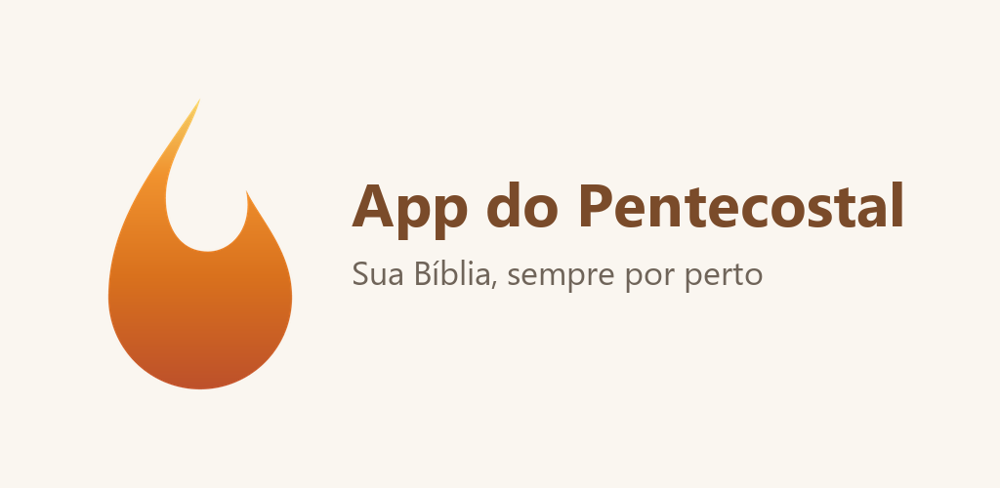
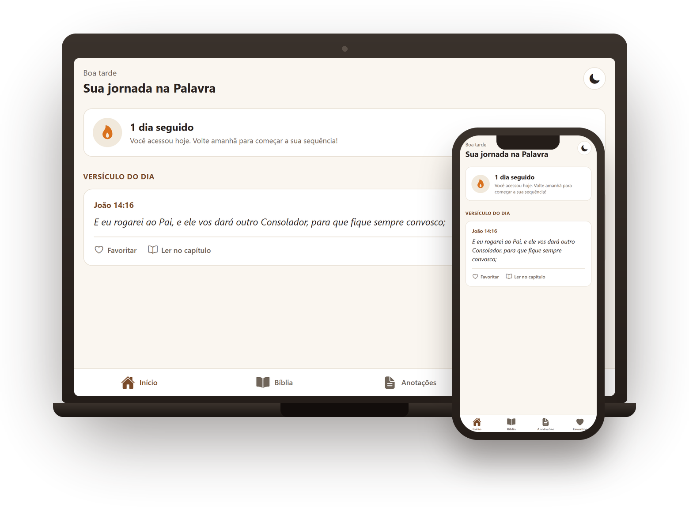

<div align="center">



# App do Pentecostal

**Leia a Bíblia, grife versículos, favorite e anote suas reflexões, sem internet.**


<br />
[](https://docs.expo.dev/versions/v57.0.0/)
[](https://reactnative.dev)
[](https://www.typescriptlang.org)
[](https://docs.expo.dev/versions/v57.0.0/sdk/sqlite/)

[Funcionalidades](#-funcionalidades) •
[Privacidade](#-privacidade) •
[Para desenvolvedores](#-para-desenvolvedores) •
[Publicando versões](#-publicando-novas-versões)

</div>

---

## 📖 Sobre

O **App do Pentecostal** é a sua Bíblia sempre por perto. Você pode ler, estudar e guardar o que marca a sua caminhada de fé, tudo num único app, simples e leve.

Não tem cadastro nem anúncios, e funciona **100% offline**. Tudo o que você marca fica salvo no seu próprio aparelho.

<div align="center">

</div>

## ✨ Funcionalidades

| | Recurso | O que faz |
|---|---|---|
| 📚 | **Bíblia completa** | Todos os 66 livros, separados em Antigo e Novo Testamento, com navegação rápida entre capítulos |
| 🔎 | **Busca por palavras** | Digite um trecho e encontre o versículo na hora |
| 🖍️ | **Grifos coloridos** | Destaque versículos em amarelo, verde, azul ou rosa |
| ❤️ | **Favoritos** | Guarde os versículos preferidos para reler quando quiser |
| 📝 | **Anotações** | Escreva reflexões ligadas a cada versículo, salvas automaticamente enquanto você digita |
| ☀️ | **Versículo do dia** | Um versículo novo a cada dia na tela inicial |
| 🔥 | **Sequência de dias** | Acompanhe quantos dias seguidos você abriu a Palavra |
| 🌙 | **Tema escuro** | Leitura confortável à noite, com um toque |
| 📶 | **Funciona sem internet** | A Bíblia inteira vem dentro do app |

## 🔒 Privacidade

- ❌ Não pede cadastro nem login
- ❌ Não exibe anúncios
- ❌ Não coleta nem compartilha nenhum dado pessoal
- ✅ Favoritos, grifos e anotações ficam **apenas no seu aparelho**

Leia a [política de privacidade completa](https://erickaocode.github.io/App-do-pentecostal/web/privacidade/).

---

## 🛠️ Para desenvolvedores

### Tecnologias

- **[Expo SDK 57](https://docs.expo.dev/versions/v57.0.0/)** + **React Native 0.86** + **React 19**, em TypeScript
- **[expo-sqlite](https://docs.expo.dev/versions/v57.0.0/sdk/sqlite/)** com dois bancos:
  - `blivre.db`: o texto bíblico, só leitura, que vai junto com o app
  - `userdata.db`: os dados da pessoa (grifos, favoritos, anotações, preferências e sequência de dias)
- **React Navigation 7**: abas na parte de baixo e pilhas de telas
- **react-native-web**: a mesma base de código roda no navegador
- **Electron**: versão para computador, que reaproveita o build web
- **EAS Build**: gera as builds de Android e iOS na nuvem

### Estrutura do projeto

```text
app/
├── App.tsx                # Provedores (SQLite, tema, navegação)
├── src/
│   ├── screens/           # Início, Livros, Capítulos, Leitura, Busca, Anotações, Favoritos
│   ├── components/        # Componentes compartilhados (menu de ações do versículo)
│   ├── db/                # Conexão e consultas dos bancos da Bíblia e do usuário
│   ├── navigation/        # Abas, pilhas e tipos de rotas
│   ├── context/           # Tema claro/escuro
│   └── utils/             # Datas, sequência de dias, versículo do dia
├── assets/bible/          # blivre.db (texto bíblico)
├── web/
│   ├── webapp/            # Build web exportado (usado também pelo app desktop)
│   ├── site/              # Página de apresentação
│   └── privacidade/       # Política de privacidade
├── desktop/               # App Electron (Windows, macOS, Linux)
└── store/                 # Textos e imagens da Play Store e da App Store
```

### Rodando localmente

Pré-requisito: **Node.js** (versão LTS).

```bash
npm install

npm start           # abre o Expo (leia o QR code com o app Expo Go)
npm run android     # emulador ou celular Android
npm run ios         # simulador iOS (só no macOS)
npm run web         # navegador
```

Para conferir os tipos:

```bash
npx tsc --noEmit
```

### Versão para computador

```bash
cd desktop
npm install
npm start           # abre o app Electron em modo de desenvolvimento
```

Mais detalhes em [`desktop/README.md`](desktop/README.md).

---

## 🚀 Publicando novas versões

<details>
<summary><b>📱 Android</b></summary>

1. Aumente o `versionCode` (e, se quiser, o `version`) em `app.json`.
2. Gere a build:

   ```bash
   npm run build:android:apk   # APK para distribuir direto
   npm run build:android:aab   # AAB para a Google Play
   ```

3. Os textos e imagens da loja estão em [`store/play-store.md`](store/play-store.md).

</details>

<details>
<summary><b>🍎 iOS</b></summary>

1. Aumente o `buildNumber` em `app.json`.
2. Gere a build e envie:

   ```bash
   npm run build:ios           # build de produção
   npm run submit:ios          # envia para o App Store Connect
   ```

3. Os textos da loja e o passo a passo estão em [`store/app-store.md`](store/app-store.md).

</details>

<details>
<summary><b>🌐 Web</b></summary>

```bash
cd desktop
npm run build:web   # exporta o app para web/webapp
```

Faça commit da pasta `web/webapp` atualizada.

</details>

<details>
<summary><b>💻 Desktop (Windows / macOS / Linux)</b></summary>

1. Atualize o build web (passo acima).
2. Aumente o `version` em `desktop/package.json`.
3. Gere o instalador:

   ```bash
   cd desktop
   npm run dist:win    # Windows (.exe)
   npm run dist        # plataforma atual
   ```

4. Crie uma release no GitHub com a tag **`desktop-vX.Y.Z`** (ex.: `desktop-v1.2.0`) e anexe o instalador e o `.blockmap`.

> [!IMPORTANT]
> O app desktop procura atualizações nas releases com tag `desktop-v…`. Se a tag tiver outro formato, quem já tem o app instalado não é avisado da nova versão.

</details>

---

## 🙏 Créditos

- Texto bíblico: **Bíblia Livre**
- Ícones: [Ionicons](https://ionic.io/ionicons), via `@expo/vector-icons`

<div align="center">

Feito com ❤️ e fé por **[Erickaocode](https://github.com/Erickaocode)**

[Reportar um problema](https://github.com/Erickaocode/App-do-pentecostal/issues)

</div>
